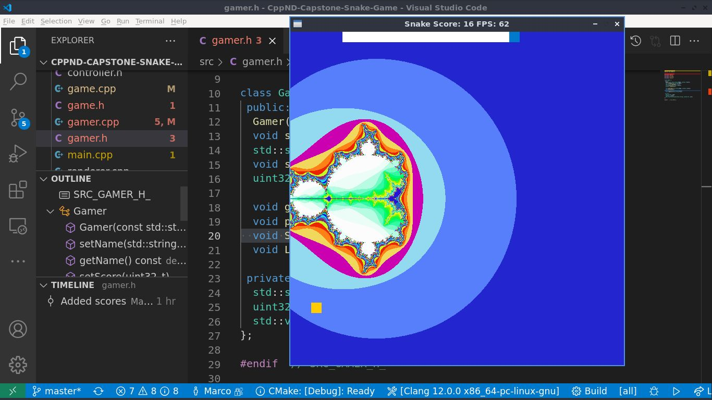
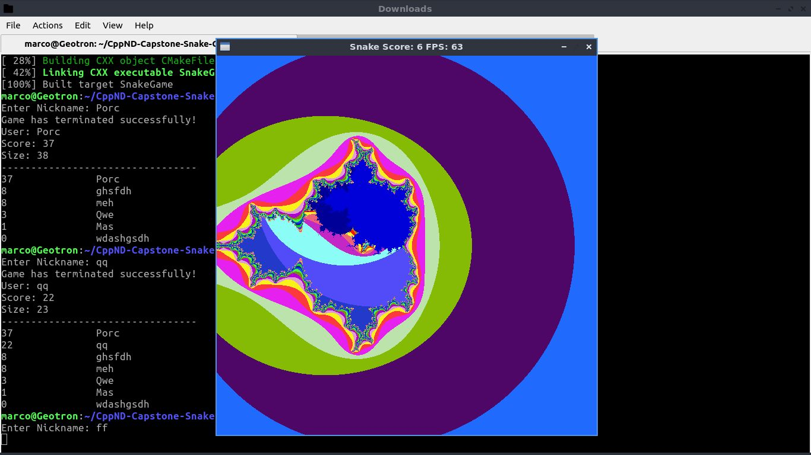
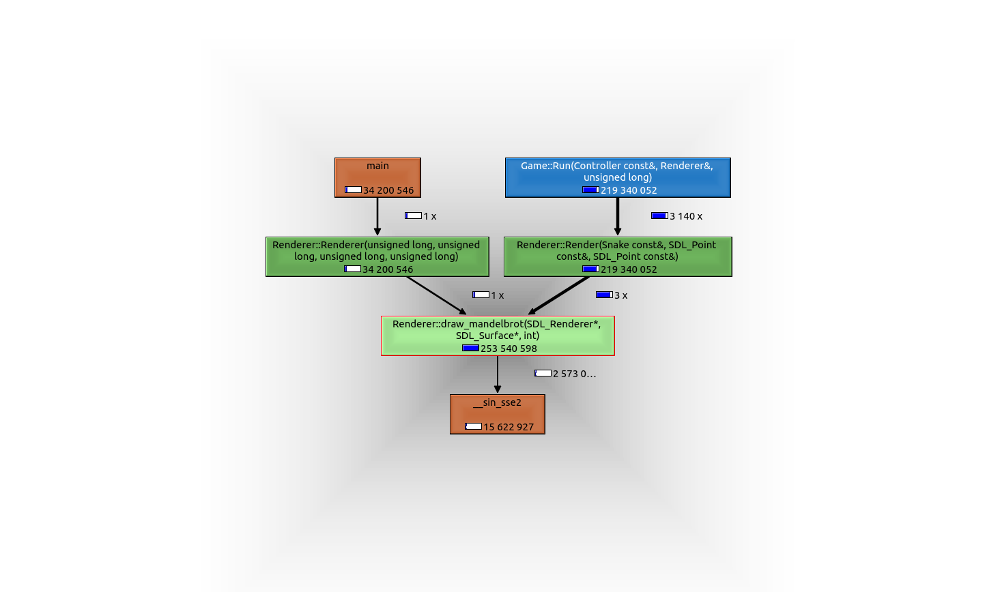

# CPPND: Capstone Snake Game Example

Capstone project in the [Udacity C++ Nanodegree Program](https://www.udacity.com/course/c-plus-plus-nanodegree--nd213). The code for this repo was inspired by [this](https://codereview.stackexchange.com/questions/212296/snake-game-in-c-with-sdl) excellent StackOverflow post and set of responses.

* Added a mandelbrot inspired from https://github.com/lucas-santoni/mandelbrot-c-sdl2 Each time the snake will eat food, a new mandelbot will be drawn.

* Added a score list file.

* Profiled and fixed bugs. The mendelbot uses a lot of CPU, beauty won't come for free.

* Game can be paused hitting the spacebar
* Game can be speeded up with +
* Game can be slowed down with -

* Added a blocker that would kill the snake, if hit.
* Added a "GAME OVER!" message in the canvas.

## Dependencies for Running Locally
* cmake >= 3.7
  * All OSes: [click here for installation instructions](https://cmake.org/install/)
* make >= 4.1 (Linux, Mac), 3.81 (Windows)
  * Linux: make is installed by default on most Linux distros
  * Mac: [install Xcode command line tools to get make](https://developer.apple.com/xcode/features/)
  * Windows: [Click here for installation instructions](http://gnuwin32.sourceforge.net/packages/make.htm)
* SDL2 >= 2.0
  * All installation instructions can be found [here](https://wiki.libsdl.org/Installation)
  >Note that for Linux, an `apt` or `apt-get` installation is preferred to building from source. 
* gcc/g++ >= 5.4
  * Linux: gcc / g++ is installed by default on most Linux distros
  * Mac: same deal as make - [install Xcode command line tools](https://developer.apple.com/xcode/features/)
  * Windows: recommend using [MinGW](http://www.mingw.org/)

## Basic Build Instructions

SDL libraries required. Install with:
`sudo apt-get install libsdl2-dev`
`sudo apt-get install libsdl2-ttf-dev`

1. Clone this repo.
2. Make a build directory in the top level directory: `mkdir build && cd build`
3. Compile: `cmake .. && make`
4. Run it: `./SnakeGame`.

Extras:
- The code will be automatically formatted running:
`make clangformat`
- Enabling "actions" in github, the project will be built and cmake tests executed

## CC Attribution-ShareAlike 4.0 International

Shield: [![CC BY-SA 4.0][cc-by-sa-shield]][cc-by-sa]

This work is licensed under a
[Creative Commons Attribution-ShareAlike 4.0 International License][cc-by-sa].

[![CC BY-SA 4.0][cc-by-sa-image]][cc-by-sa]

[cc-by-sa]: http://creativecommons.org/licenses/by-sa/4.0/
[cc-by-sa-image]: https://licensebuttons.net/l/by-sa/4.0/88x31.png
[cc-by-sa-shield]: https://img.shields.io/badge/License-CC%20BY--SA%204.0-lightgrey.svg
